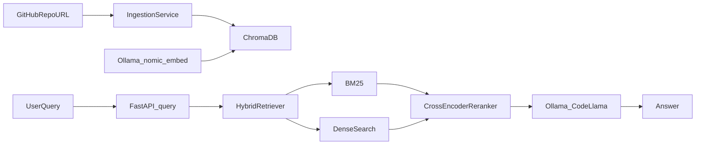

# CodeBase Oracle — AI Agent Execution Blueprint

> **Audience:** AI coding agents and CSE engineers with Python, FastAPI, Docker, and basic ML knowledge.
> **Goal:** Zero-to-running, locally-hosted, zero-API-cost codebase chat assistant backed by RAG.
> **Source:** Derived from the original [codebase_oracle_blueprint (1).md](codebase_oracle_blueprint%20(1).md).

---

## Agent Execution Rules

1. Execute **exactly one step** per agent session unless the step explicitly says otherwise.
2. Do **not** start the next step until that step's **Acceptance criteria** all pass.
3. Do **not** change the tech stack: no Qdrant, Redis, SQLite metadata store, separate worker process, or graph database.
4. Follow file paths in **Section 3 (Repository Layout)** as ground truth.
5. Use `uvicorn --workers 1` during local development; use `--workers 2` only in the final Docker Compose backend service.
6. Build the golden QA test set at **Step 1.10** before tuning retrieval.
7. Only create git commits when the user explicitly asks.
8. When a step references code samples below, implement them in the named file paths — do not invent alternate module layouts.

**How to invoke this blueprint:**

> "Execute Step 2.3 from oracle_blueprint_refactor_d458e4e5.plan.md"

---

## 1. System Overview

### Architecture

```
GitHub Repo URL
      │
      ▼
[Ingestion Service]  ──tree-sitter AST chunking──►  [ChromaDB]  ◄── nomic-embed-text (Ollama)
                                                         │
                                                         ▼
User Query ──► [FastAPI /query] ──► [Hybrid Retriever] ──► [Reranker] ──► [Ollama LLM] ──► Answer
                                      BM25 + Dense                        Llama3 / CodeLlama
```



### Core Design Decisions

| Decision | Choice | Rationale |
|---|---|---|
| Chunking strategy | AST-based via tree-sitter | 70.1% Recall@5 vs 42.4% for fixed-size (cAST paper, 2025) |
| Retrieval | Hybrid BM25 + Dense | Recall improves from ~0.72 (BM25 alone) to ~0.91 (hybrid) |
| Reranking | cross-encoder/ms-marco-MiniLM-L-6-v2 | +35–40% answer accuracy vs no reranking; runs locally in <50ms |
| Embedding | nomic-embed-text (Ollama) | 8192 token context, code-aware, fully local |
| LLM | CodeLlama 13B or Llama3 8B (Ollama) | Code-specific reasoning; runs on 12GB VRAM or CPU fallback |
| Vector DB | ChromaDB persistent | Simple, file-based, no extra infra |
| API | FastAPI + WebSocket | Streaming token output for UX |
| Containerisation | Docker Compose | 5-service stack, one command startup |

### Service Map

```
┌─────────────────────────────────────────────────────────────┐
│                     Docker Compose Network                   │
│                                                             │
│  ┌──────────────┐    ┌──────────────┐   ┌───────────────┐  │
│  │   frontend   │    │   backend    │   │    ollama     │  │
│  │  React/Vite  │───►│   FastAPI    │──►│  :11434       │  │
│  │  :5173       │    │  :8000       │   │  codellama    │  │
│  └──────────────┘    └──────┬───────┘   │  nomic-embed  │  │
│                             │           └───────────────┘  │
│                             ▼                               │
│                    ┌──────────────┐                         │
│                    │   chroma     │                         │
│                    │  ChromaDB    │                         │
│                    │  :8001       │                         │
│                    │  /chroma_data│                         │
│                    └──────────────┘                         │
└─────────────────────────────────────────────────────────────┘
```

### Port Allocation

| Service | Port | Purpose |
|---|---|---|
| frontend | 5173 | Vite dev server |
| backend | 8000 | FastAPI REST + WS |
| ollama | 11434 | LLM + embed inference |
| chroma | 8001 | Vector DB HTTP API |

### Hardware Requirements

| Tier | CPU | RAM | GPU | LLM Model |
|---|---|---|---|---|
| Minimum | 8-core | 16 GB | None | Llama3:8b (CPU, slow ~2 tok/s) |
| Recommended | 8-core | 32 GB | RTX 3080 / 4060 (10–12 GB VRAM) | CodeLlama:13b (GPU, ~15 tok/s) |
| Ideal | 16-core | 64 GB | RTX 4090 / A10 (24 GB VRAM) | CodeLlama:34b (GPU, ~12 tok/s) |

---

## 2. Repository Layout

```
codebase-oracle/
├── docker-compose.yml
├── .env
├── .gitignore
├── README.md
├── backend/
│   ├── Dockerfile
│   ├── requirements.txt
│   ├── main.py
│   ├── api/
│   │   ├── routes_ingest.py
│   │   ├── routes_query.py
│   │   └── routes_repos.py
│   ├── ingestion/
│   │   ├── orchestrator.py
│   │   ├── git_cloner.py
│   │   ├── file_walker.py
│   │   ├── ast_chunker.py
│   │   ├── embedding_service.py
│   │   ├── chroma_writer.py
│   │   └── bm25_builder.py
│   ├── retrieval/
│   │   ├── hybrid_retriever.py
│   │   ├── dense_retriever.py
│   │   ├── sparse_retriever.py
│   │   ├── rrf_fusion.py
│   │   ├── reranker.py
│   │   ├── prompt_builder.py
│   │   └── ollama_client.py
│   ├── models/
│   │   └── schemas.py
│   ├── core/
│   │   ├── config.py
│   │   ├── dependencies.py
│   │   └── logger.py
│   └── jobs/
│       └── job_store.py
├── frontend/
│   ├── Dockerfile
│   ├── package.json
│   ├── vite.config.js
│   └── src/
│       ├── main.jsx
│       ├── App.jsx
│       ├── components/
│       ├── hooks/
│       ├── services/
│       └── styles/
├── chroma_data/
├── ollama_models/
├── repos_cache/
└── tests/
    ├── golden_qa/
    ├── eval_retrieval.py
    ├── eval_generation.py
    ├── load_test.py
    └── conftest.py
```

### File Ownership Rules

| Directory | Owns | Does NOT own |
|---|---|---|
| `api/` | HTTP request/response shape, status codes | Business logic, DB calls |
| `ingestion/` | Chunking, embedding, writing to ChromaDB | Query-time logic |
| `retrieval/` | Search, ranking, prompt assembly, LLM call | Ingestion, DB writes |
| `models/` | Shared data contracts (Pydantic) | Any logic |
| `core/` | App-wide config, DI, logging | Feature logic |
| `jobs/` | Job lifecycle tracking | Actual job execution |

### Data Flow

```
1. User submits repo URL
        │
        ▼
   api/routes_ingest.py
        │
        ▼
   ingestion/orchestrator.py
        ├──► ingestion/git_cloner.py      → repos_cache/{hash}/
        ├──► ingestion/file_walker.py
        ├──► ingestion/ast_chunker.py
        ├──► ingestion/embedding_service.py → ollama:11434
        ├──► ingestion/chroma_writer.py   → chroma_data/
        └──► ingestion/bm25_builder.py    → /tmp/bm25/{repo_id}.pkl

2. User sends a query
        │
        ▼
   api/routes_query.py
        │
        ▼
   retrieval/hybrid_retriever.py
        ├──► retrieval/dense_retriever.py   → chroma:8000
        ├──► retrieval/sparse_retriever.py  → BM25 pickle
        ├──► retrieval/rrf_fusion.py
        ├──► retrieval/reranker.py
        └──► retrieval/prompt_builder.py → retrieval/ollama_client.py → frontend
```

---

## 3. Environment Variables

Create `.env` from this template (never commit `.env`):

```bash
GITHUB_TOKEN=ghp_xxxxxxxxxxxxx
OLLAMA_URL=http://ollama:11434
CHROMA_HOST=http://chroma:8000
DEFAULT_LLM_MODEL=codellama:13b
MAX_REPO_SIZE_MB=500
LOG_LEVEL=info
BM25_CACHE_DIR=/tmp/bm25
```

---

## 4. Step-by-Step Build Instructions

---

### Phase 0 — Environment Bootstrap (Day 1)

#### Step 0.1 — Install Ollama and pull models

- **Objective:** Have all required local models available before any code is written.
- **Depends on:** none
- **Files to create/edit:** none
- **Implementation notes:** Pull primary code LLM, embedding model, and fallback chat model.
- **Commands to run:**

```bash
curl -fsSL https://ollama.com/install.sh | sh
ollama pull codellama:13b
ollama pull nomic-embed-text
ollama pull llama3:8b
curl http://localhost:11434/api/tags
```

- **Acceptance criteria:** `curl http://localhost:11434/api/tags` returns JSON listing all three models.
- **Do NOT:** proceed without embedding model; do not use cloud API keys.

---

#### Step 0.2 — Create project scaffold

- **Objective:** Create the directory tree matching Section 2.
- **Depends on:** Step 0.1
- **Files to create/edit:**
  - `backend/api/`, `backend/ingestion/`, `backend/retrieval/`, `backend/models/`, `backend/core/`, `backend/jobs/`
  - `frontend/src/`, `chroma_data/`, `ollama_models/`, `repos_cache/`, `tests/golden_qa/`
- **Commands to run:**

```bash
mkdir -p backend/{api,ingestion,retrieval,models,core,jobs}
mkdir -p frontend/src/{components,hooks,services,styles}
mkdir -p chroma_data ollama_models repos_cache tests/golden_qa
touch backend/api/__init__.py backend/ingestion/__init__.py backend/retrieval/__init__.py
touch backend/models/__init__.py backend/core/__init__.py backend/jobs/__init__.py
```

- **Acceptance criteria:** `find . -type d | sort` matches Section 2 layout (minus files not yet created).
- **Do NOT:** create Qdrant, Redis, or worker directories.

---

#### Step 0.3 — Add root config files

- **Objective:** Add environment template, gitignore, README stub, and docker-compose stub.
- **Depends on:** Step 0.2
- **Files to create/edit:** `.env.example`, `.gitignore`, `README.md`, `docker-compose.yml` (stub with service names only)
- **Acceptance criteria:** `.gitignore` excludes `.env`, `chroma_data/`, `ollama_models/`, `repos_cache/`, `node_modules/`.
- **Do NOT:** commit `.env` with real tokens.

---

#### Step 0.4 — Add backend requirements

- **Objective:** Pin all Python dependencies from the original blueprint.
- **Depends on:** Step 0.2
- **Files to create/edit:** `backend/requirements.txt`

```
fastapi==0.115.0
uvicorn[standard]==0.30.0
httpx==0.27.0
chromadb==0.5.0
gitpython==3.1.43
tree-sitter==0.21.3
tree-sitter-python==0.21.0
tree-sitter-javascript==0.21.0
tree-sitter-typescript==0.21.0
tree-sitter-java==0.21.0
tree-sitter-go==0.21.0
tree-sitter-rust==0.21.0
rank-bm25==0.2.2
sentence-transformers==3.0.0
pydantic==2.7.0
python-multipart==0.0.9
numpy
```

- **Commands to run:**

```bash
cd backend && python -m venv .venv && source .venv/bin/activate && pip install -r requirements.txt
```

- **Acceptance criteria:** `pip install -r requirements.txt` exits 0.
- **Do NOT:** add qdrant-client, redis, arq, or sqlmodel.

---

#### Step 0.5 — Health endpoint stub

- **Objective:** Boot a minimal FastAPI app with config, logging, and health check.
- **Depends on:** Step 0.4
- **Files to create/edit:**
  - `backend/core/config.py` — Pydantic Settings reading `OLLAMA_URL`, `CHROMA_HOST`, `GITHUB_TOKEN`, `MAX_REPO_SIZE_MB`, `LOG_LEVEL`, `BM25_CACHE_DIR`
  - `backend/core/logger.py` — structured logging
  - `backend/main.py` — FastAPI app with `GET /api/v1/health`
- **Commands to run:**

```bash
cd backend && uvicorn main:app --host 0.0.0.0 --port 8000 --workers 1
curl http://localhost:8000/api/v1/health
```

- **Acceptance criteria:** Health endpoint returns `{"status": "ok"}` or equivalent JSON.
- **Do NOT:** add ingestion or retrieval routes yet.

**Phase 0 gate:** Ollama models pulled; scaffold exists; health endpoint responds.

---

### Phase 1 — Ingestion Pipeline (Days 2–4)

#### Step 1.1 — Git cloner

- **Objective:** Clone or pull GitHub repos with size guard and token support.
- **Depends on:** Step 0.5
- **Files to create/edit:** `backend/ingestion/git_cloner.py`
- **Implementation notes:** Shallow clone (`depth=1`); use `GITHUB_TOKEN` from env for private repos; reject repos > `MAX_REPO_SIZE_MB`; clone to `/tmp/repos/{md5(url)[:8]}`.
- **Acceptance criteria:** Cloning a small public repo succeeds; oversized repo is rejected.
- **Do NOT:** skip size guard; do not hardcode tokens.

---

#### Step 1.2 — File walker

- **Objective:** Walk cloned repo tree; map extensions to languages; skip binaries and vendor dirs.
- **Depends on:** Step 1.1
- **Files to create/edit:** `backend/ingestion/file_walker.py`
- **Implementation notes:** Skip `.git`, `node_modules`, `dist`, `build`, `__pycache__`, binaries. Supported extensions per orchestrator `SUPPORTED_EXTENSIONS`.
- **Acceptance criteria:** Walker returns only source files for a test repo; skips `node_modules`.
- **Do NOT:** index `.env` or credential files.

---

#### Step 1.3 — AST chunker

- **Objective:** Parse source files with tree-sitter; chunk by AST nodes; fallback to sliding window.
- **Depends on:** Step 1.2
- **Files to create/edit:** `backend/ingestion/ast_chunker.py`
- **Implementation notes:** Use algorithm from Section 5 (ASTChunker). Language matrix: Python, JS/TS, Java, Go, Rust. `CHUNK_TOKEN_LIMIT = 512`, `CHUNK_OVERLAP_LINES = 3`. Return dicts with `text`, `file_path`, `language`, `chunk_type`, `start_line`, `end_line`, `symbol_name`.
- **Acceptance criteria:** Python function file produces at least one chunk with valid line ranges and `symbol_name`.
- **Do NOT:** use fixed-size-only chunking as primary strategy.

---

#### Step 1.4 — Embedding service

- **Objective:** Batch-embed chunk texts via Ollama `nomic-embed-text`.
- **Depends on:** Step 0.1
- **Files to create/edit:** `backend/ingestion/embedding_service.py`
- **Implementation notes:**

```python
OLLAMA_URL = "http://ollama:11434"  # or from config
EMBED_MODEL = "nomic-embed-text"
BATCH_SIZE = 32
# POST /api/embeddings with {"model": EMBED_MODEL, "prompt": text[:8000]}
```

- **Acceptance criteria:** Embedding 3 test strings returns 768-dim vectors.
- **Do NOT:** call OpenAI or other cloud embedding APIs.

---

#### Step 1.5 — Chroma writer

- **Objective:** Upsert chunks + embeddings + metadata into ChromaDB persistent client.
- **Depends on:** Step 1.4
- **Files to create/edit:** `backend/ingestion/chroma_writer.py`
- **Implementation notes:** `chromadb.PersistentClient(path=persist_dir)`; collection per repo `repo_{md5(url)[:8]}`; metadata: `file_path`, `language`, `chunk_type`, `start_line`, `end_line`, `symbol_name`; `hnsw:space = cosine`.
- **Acceptance criteria:** Upsert 3 chunks; query returns them with metadata.
- **Do NOT:** run a separate Chroma server client and PersistentClient on the same path simultaneously during dev.

---

#### Step 1.6 — BM25 builder

- **Objective:** Build and persist BM25 index after ingestion completes.
- **Depends on:** Step 1.5
- **Files to create/edit:** `backend/ingestion/bm25_builder.py`
- **Implementation notes:** Use `rank_bm25.BM25Okapi`; persist tokenized corpus to `BM25_CACHE_DIR/{repo_id}.json` or pickle; build atomically at end of ingest.
- **Acceptance criteria:** After ingest, BM25 file exists and corpus length matches Chroma doc count.
- **Do NOT:** build BM25 only at query time without persistence.

---

#### Step 1.7 — Ingestion orchestrator

- **Objective:** Coordinate clone → walk → chunk → embed → Chroma → BM25.
- **Depends on:** Steps 1.1–1.6
- **Files to create/edit:** `backend/ingestion/orchestrator.py`
- **Implementation notes:** Follow original orchestrator pattern; support `progress_callback`; return `{repo_id, collection, chunks_indexed}`.
- **Acceptance criteria:** End-to-end script ingests tiny repo; Chroma collection has records.
- **Do NOT:** hold entire repo chunks in memory without batching for large repos.

---

#### Step 1.8 — Ingest API route (early)

- **Objective:** Expose `POST /api/v1/ingest` to trigger background ingestion.
- **Depends on:** Step 1.7, Step 0.5
- **Files to create/edit:** `backend/api/routes_ingest.py`, wire in `backend/main.py`
- **Implementation notes:** Request body `{repo_url, branch}`; return `{job_id, status}`; use `jobs/job_store.py` for progress.
- **Acceptance criteria:** `curl -X POST /api/v1/ingest` returns `job_id`; job completes with chunks indexed.
- **Do NOT:** block HTTP response until full ingest completes.

---

#### Step 1.9 — Golden QA fixture

- **Objective:** Create evaluation fixture before retrieval tuning.
- **Depends on:** Step 1.7
- **Files to create/edit:** `tests/golden_qa/tiny_repo_qa.json`, `tests/golden_qa/README.md`
- **Implementation notes:** At least 5 questions with `question`, `expected_file`, `expected_symbol`, `answer_keywords`.
- **Acceptance criteria:** JSON validates; questions match the indexed test repo.
- **Do NOT:** defer golden QA to Phase 7 only.

---

#### Step 1.10 — End-to-end ingest verification

- **Objective:** Verify full ingest pipeline on a small public GitHub repo.
- **Depends on:** Steps 1.7–1.9
- **Commands to run:**

```bash
# Ingest via API or CLI script
curl -X POST http://localhost:8000/api/v1/ingest \
  -H "Content-Type: application/json" \
  -d '{"repo_url": "https://github.com/<small-public-repo>", "branch": "main"}'
```

- **Acceptance criteria:** Chroma collection has chunks with all required metadata fields.
- **Do NOT:** proceed to Phase 2 if Chroma is empty.

**Phase 1 gate:** Ingest works; BM25 persisted; golden QA exists.

---

### Phase 2 — Hybrid Retrieval (Days 5–7)

#### Step 2.1 — Dense retriever

- **Objective:** Query ChromaDB with cosine similarity; return top-50 candidates.
- **Depends on:** Phase 1 gate
- **Files to create/edit:** `backend/retrieval/dense_retriever.py`
- **Acceptance criteria:** Query returns documents with distances and metadata.
- **Do NOT:** embed query with a different model than ingestion.

---

#### Step 2.2 — Sparse retriever

- **Objective:** Load BM25 index from disk; return top-50 lexical candidates.
- **Depends on:** Step 1.6
- **Files to create/edit:** `backend/retrieval/sparse_retriever.py`
- **Acceptance criteria:** Identifier-heavy query returns expected symbol in top results.
- **Do NOT:** rebuild BM25 from scratch on every query.

---

#### Step 2.3 — RRF fusion

- **Objective:** Merge dense and sparse ranked lists via Reciprocal Rank Fusion.
- **Depends on:** Steps 2.1, 2.2
- **Files to create/edit:** `backend/retrieval/rrf_fusion.py`
- **Implementation notes:** RRF formula `score += 1 / (rank + k)` with `k=60`; dedupe by chunk text or stable id.
- **Acceptance criteria:** Unit test: merged list contains items from both dense and sparse arms.
- **Do NOT:** use only dense or only sparse in production path.

---

#### Step 2.4 — Cross-encoder reranker

- **Objective:** Rerank fused candidates from top-50 to top-8.
- **Depends on:** Step 2.3
- **Files to create/edit:** `backend/retrieval/reranker.py`
- **Implementation notes:** `CrossEncoder("cross-encoder/ms-marco-MiniLM-L-6-v2", max_length=512)`; lazy-load model.
- **Acceptance criteria:** Reranker returns 8 chunks; latency < 200ms on CPU for 50 pairs.
- **Do NOT:** skip reranking in default query path.

---

#### Step 2.5 — Hybrid retriever

- **Objective:** Compose dense + sparse + RRF + rerank into single `retrieve()` API.
- **Depends on:** Steps 2.1–2.4
- **Files to create/edit:** `backend/retrieval/hybrid_retriever.py`
- **Implementation notes:** Follow original hybrid retriever sample in Section 6 of original blueprint.
- **Acceptance criteria:** `await retriever.retrieve(query, final_k=8)` returns ranked chunks with scores.
- **Do NOT:** call `embedder._embed_one(None, query)` — pass a real httpx client.

---

#### Step 2.6 — Retrieval evaluation script

- **Objective:** Measure Recall@5 and MRR against golden QA.
- **Depends on:** Step 1.9, Step 2.5
- **Files to create/edit:** `tests/eval_retrieval.py`, `tests/conftest.py`
- **Commands to run:**

```bash
cd backend && python -m pytest ../tests/eval_retrieval.py -v
# or: python tests/eval_retrieval.py --repo-id <id>
```

- **Acceptance criteria:** Interim `Recall@5 >= 0.50` on tiny_repo golden set.
- **Do NOT:** use synchronous calls to async `retrieve()` without `asyncio.run`.

**Phase 2 gate:** Hybrid retrieval passes interim Recall@5 >= 0.50.

---

### Phase 3 — LLM Generation (Days 8–9)

#### Step 3.1 — Prompt builder

- **Objective:** Assemble system prompt + code context + user query with file/line citations.
- **Depends on:** Phase 2 gate
- **Files to create/edit:** `backend/retrieval/prompt_builder.py`
- **Implementation notes:** Use `SYSTEM_PROMPT` from original blueprint Section 7.
- **Acceptance criteria:** Prompt includes all chunk file paths and line ranges.
- **Do NOT:** include chunks without provenance metadata.

---

#### Step 3.2 — Ollama streaming client

- **Objective:** Stream tokens from Ollama `/api/chat`.
- **Depends on:** Step 3.1
- **Files to create/edit:** `backend/retrieval/ollama_client.py`
- **Implementation notes:** Default model `codellama:13b`; `temperature=0.1`, `num_ctx=8192`.
- **Acceptance criteria:** Streaming yields tokens for a test prompt.
- **Do NOT:** use cloud LLM APIs.

---

#### Step 3.3 — Context window guard

- **Objective:** Trim context if total tokens exceed model limit (4096 for 7B, 8192 for 13B).
- **Depends on:** Step 3.1
- **Files to create/edit:** logic in `prompt_builder.py` or helper module
- **Acceptance criteria:** Oversized context is trimmed without crashing Ollama.
- **Do NOT:** send unbounded context to the LLM.

---

#### Step 3.4 — Hallucination guardrail

- **Objective:** Refuse to answer when retrieval confidence is too low.
- **Depends on:** Step 2.5
- **Implementation notes:** `MIN_SIMILARITY_THRESHOLD = 0.25`; check best dense score before LLM call; return fixed refusal string.
- **Acceptance criteria:** Low-similarity query returns refusal, not fabricated answer.
- **Do NOT:** call LLM when no chunks retrieved.

---

#### Step 3.5 — CLI end-to-end script

- **Objective:** Prove ingest → retrieve → generate without UI.
- **Depends on:** Steps 3.1–3.4
- **Files to create/edit:** `tests/smoke_e2e.py` or similar
- **Acceptance criteria:** Answer cites file paths from retrieved chunks.
- **Do NOT:** require frontend for this gate.

**Phase 3 gate:** E2E script produces cited answer or valid refusal.

---

### Phase 4 — FastAPI Backend (Days 10–11)

#### Step 4.1 — Pydantic schemas

- **Objective:** Define all request/response models.
- **Depends on:** Step 0.5
- **Files to create/edit:** `backend/models/schemas.py`
- **Models:** `IngestRequest`, `QueryRequest`, `QueryResponse`, `SourceChunk`
- **Acceptance criteria:** Invalid payloads return 422.

---

#### Step 4.2 — Job store

- **Objective:** Track ingestion jobs in memory.
- **Depends on:** Step 1.8
- **Files to create/edit:** `backend/jobs/job_store.py`
- **Implementation notes:** Dict `{job_id → {status, progress, current_file, error}}`.
- **Acceptance criteria:** Job create/read/update works.
- **Do NOT:** use `--workers 2` until job store is externalized.

---

#### Step 4.3 — Ingest routes + SSE progress

- **Objective:** Complete ingest API with live progress stream.
- **Depends on:** Steps 1.8, 4.2
- **Files to create/edit:** `backend/api/routes_ingest.py`
- **Endpoints:**
  - `POST /api/v1/ingest` → `{job_id, status}`
  - `GET /api/v1/ingest/{job_id}/status` → SSE `{progress, current_file}`
- **Acceptance criteria:** SSE emits progress events during ingest.

---

#### Step 4.4 — Query route

- **Objective:** Non-streaming query endpoint.
- **Depends on:** Phase 3 gate
- **Files to create/edit:** `backend/api/routes_query.py`
- **Endpoint:** `POST /api/v1/query` → `{answer, sources, model_used}`
- **Acceptance criteria:** `curl` query returns answer and sources array.

---

#### Step 4.5 — WebSocket chat

- **Objective:** Streaming chat over WebSocket.
- **Depends on:** Step 3.2
- **Files to create/edit:** `backend/api/routes_query.py`
- **Endpoint:** `WS /api/v1/ws/chat`
- **Event types:** `token`, `sources`, `done`, `error`
- **Acceptance criteria:** WebSocket client receives token stream.

---

#### Step 4.6 — Repo management + health routes

- **Objective:** List repos, delete collection, health check dependencies.
- **Depends on:** Step 0.5
- **Files to create/edit:** `backend/api/routes_repos.py`
- **Endpoints:**
  - `GET /api/v1/repos`
  - `DELETE /api/v1/repos/{repo_id}`
  - `GET /api/v1/health` → `{status, chroma, ollama}`
- **Acceptance criteria:** Health reports chroma and ollama status.

---

#### Step 4.7 — Wire app + CORS + dependencies

- **Objective:** Mount all routers; add CORS; dependency injection for Chroma, embedder, retriever.
- **Depends on:** Steps 4.3–4.6
- **Files to create/edit:** `backend/main.py`, `backend/core/dependencies.py`
- **Acceptance criteria:** All 7 endpoints respond correctly via `curl` and WebSocket test client.
- **Do NOT:** put business logic in route handlers.

**Phase 4 gate:** Full API works without frontend.

---

### Phase 5 — React Frontend (Days 12–14)

#### Step 5.1 — Vite scaffold

- **Objective:** Create React + Vite app with API proxy.
- **Depends on:** Phase 4 gate
- **Files to create/edit:** `frontend/package.json`, `frontend/vite.config.js`, `frontend/index.html`, `frontend/src/main.jsx`
- **Acceptance criteria:** `npm run dev` serves UI on :5173; `/api` proxies to backend.

---

#### Step 5.2 — Repo panel + ingestion progress

- **Objective:** URL input, branch selector, ingest button, SSE progress bar.
- **Depends on:** Step 5.1
- **Files to create/edit:**
  - `frontend/src/components/Sidebar/RepoManager.jsx`
  - `frontend/src/components/Sidebar/IngestionProgress.jsx`
  - `frontend/src/hooks/useIngestion.js`
- **Acceptance criteria:** Ingest from UI shows live progress.

---

#### Step 5.3 — Chat window + streaming

- **Objective:** Message thread with streaming token rendering.
- **Depends on:** Step 5.1
- **Files to create/edit:**
  - `frontend/src/components/Chat/ChatWindow.jsx`
  - `frontend/src/hooks/useStreamingChat.js`
- **Implementation notes:** WebSocket to `ws://localhost:8000/api/v1/ws/chat`; handle `token`, `sources`, `done` events.
- **Acceptance criteria:** User sees tokens stream in real time.

---

#### Step 5.4 — Source cards

- **Objective:** Collapsible code snippet cards with file path and line range.
- **Depends on:** Step 5.3
- **Files to create/edit:**
  - `frontend/src/components/Sources/SourceCards.jsx`
  - `frontend/src/components/Sources/CodeSnippetCard.jsx`
- **Acceptance criteria:** Sources render below assistant messages.

---

#### Step 5.5 — Model selector + repo list

- **Objective:** Switch Llama3 / CodeLlama; list indexed repos.
- **Depends on:** Step 5.2
- **Files to create/edit:**
  - `frontend/src/components/Sidebar/IndexedRepoList.jsx`
  - `frontend/src/hooks/useRepos.js`
  - `frontend/src/services/api.js`
- **Acceptance criteria:** Model selection passed to WebSocket; repo list loads from API.

---

#### Step 5.6 — App layout

- **Objective:** Wire Sidebar + ChatWindow in top-level App.
- **Depends on:** Steps 5.2–5.5
- **Files to create/edit:** `frontend/src/App.jsx`, `frontend/src/styles/index.css`
- **Acceptance criteria:** Full UI flow — index repo, watch progress, ask question, see sources.
- **Do NOT:** add eval UI before core chat works.

**Phase 5 gate:** Full UI flow works against local backend.

---

### Phase 6 — Containerisation (Day 15)

#### Step 6.1 — Backend Dockerfile

- **Objective:** Containerize FastAPI backend.
- **Depends on:** Phase 4 gate
- **Files to create/edit:** `backend/Dockerfile`
- **Implementation notes:** `python:3.11-slim`; install git curl; `uvicorn main:app --workers 2`.

---

#### Step 6.2 — Frontend Dockerfile

- **Objective:** Containerize Vite dev server (or build+serve for prod).
- **Depends on:** Phase 5 gate
- **Files to create/edit:** `frontend/Dockerfile`
- **Implementation notes:** `node:20-alpine`; expose :5173.

---

#### Step 6.3 — Docker Compose full stack

- **Objective:** 5-service stack with healthchecks and volume mounts.
- **Depends on:** Steps 6.1, 6.2
- **Files to create/edit:** `docker-compose.yml`
- **Services:** `ollama`, `model-puller`, `chroma`, `backend`, `frontend`
- **Volumes:** `./chroma_data`, `./ollama_models`, `./repos_cache`
- **Acceptance criteria:** See Section 8 (Docker Compose) for full YAML.

---

#### Step 6.4 — Cold start smoke test

- **Objective:** Verify full stack from `docker compose up --build`.
- **Depends on:** Step 6.3
- **Commands to run:**

```bash
docker compose up --build
curl http://localhost:8000/api/v1/health
# ingest tiny repo → query → verify answer
```

- **Acceptance criteria:** All services healthy; ingest and query succeed.
- **Do NOT:** skip model-puller dependency.

**Phase 6 gate:** Cold Docker start → health → ingest → query.

---

### Phase 7 — Evaluation and Hardening (Day 15+)

#### Step 7.1 — Expand golden QA

- **Objective:** Grow test set to 20–30 questions for indexed repo.
- **Depends on:** Step 1.9
- **Files to create/edit:** `tests/golden_qa/{repo_name}_qa.json`
- **Acceptance criteria:** 20+ questions covering files, symbols, and intents.

---

#### Step 7.2 — Retrieval metrics

- **Objective:** Hit original quality targets.
- **Depends on:** Step 2.6
- **Commands to run:** `python tests/eval_retrieval.py`
- **Acceptance criteria:** `Recall@5 > 0.70`, `MRR > 0.60`.

---

#### Step 7.3 — Generation faithfulness eval

- **Objective:** LLM-as-judge or keyword overlap for answer faithfulness.
- **Depends on:** Phase 3 gate
- **Files to create/edit:** `tests/eval_generation.py`
- **Acceptance criteria:** Faithfulness score > 0.80 on golden set.

---

#### Step 7.4 — Load test

- **Objective:** Measure p95 query latency under concurrent load.
- **Depends on:** Phase 6 gate
- **Files to create/edit:** `tests/load_test.py`
- **Acceptance criteria:** p95 < 8 seconds on GPU tier.

---

#### Step 7.5 — Security hardening

- **Objective:** Apply security checklist from Section 9.
- **Depends on:** Phase 4 gate
- **Implementation notes:** Add `slowapi` rate limit on `/ingest`; validate GitHub-only URLs; enforce `MAX_REPO_SIZE_MB`.
- **Acceptance criteria:** Bad URLs rejected; rate limit triggers on spam ingest.

**Phase 7 gate:** Metrics meet targets; security checks pass.

---

## 5. API Contract

### Endpoints

| Method | Path | Request Body | Response | Description |
|---|---|---|---|---|
| POST | `/api/v1/ingest` | `{repo_url, branch}` | `{job_id, status}` | Kick off background ingestion |
| GET | `/api/v1/ingest/{job_id}/status` | — | SSE `{progress, current_file}` | Live ingestion progress |
| POST | `/api/v1/query` | `{repo_id, question, model?}` | `{answer, sources}` | Non-streaming query |
| WS | `/api/v1/ws/chat` | `{repo_id, question, model?}` | Token stream | Streaming chat |
| GET | `/api/v1/repos` | — | `[{repo_id, url, chunks, indexed_at}]` | List indexed repos |
| DELETE | `/api/v1/repos/{repo_id}` | — | `{deleted: true}` | Wipe collection |
| GET | `/api/v1/health` | — | `{status, chroma, ollama}` | Health check |

### Pydantic Schemas

```python
from pydantic import BaseModel, HttpUrl
from typing import Optional

class IngestRequest(BaseModel):
    repo_url: HttpUrl
    branch: str = "main"

class QueryRequest(BaseModel):
    repo_id: str
    question: str
    model: Optional[str] = "codellama:13b"

class SourceChunk(BaseModel):
    file_path: str
    start_line: int
    end_line: int
    chunk_type: str
    symbol_name: str
    text: str

class QueryResponse(BaseModel):
    answer: str
    sources: list[SourceChunk]
    model_used: str
```

### WebSocket Protocol

Client sends on open:

```json
{"repo_id": "abc123", "question": "How does auth work?", "model": "codellama:13b"}
```

Server emits:

```json
{"type": "sources", "sources": [...]}
{"type": "token", "token": "The"}
{"type": "done"}
{"type": "error", "message": "..."}
```

---

## 6. Frontend Contract

### Component Tree

```
App
├── Sidebar
│   ├── RepoManager (URL, branch, ingest button)
│   ├── IngestionProgress (SSE progress bar)
│   └── IndexedRepoList (repo cards)
└── ChatWindow
    ├── ModelSelector (Llama3 / CodeLlama)
    ├── MessageThread
    │   ├── UserMessage
    │   └── AssistantMessage (streaming text + SourceCards)
    └── QueryInput
```

### useStreamingChat Hook Pattern

```javascript
export function useStreamingChat() {
  const wsRef = useRef(null);
  const sendMessage = (repoId, question, model = "codellama:13b") => {
    wsRef.current = new WebSocket("ws://localhost:8000/api/v1/ws/chat");
    wsRef.current.onopen = () => {
      wsRef.current.send(JSON.stringify({ repo_id: repoId, question, model }));
    };
    wsRef.current.onmessage = (e) => {
      const data = JSON.parse(e.data);
      if (data.type === "token") { /* append token */ }
      if (data.type === "sources") { /* set sources */ }
      if (data.type === "done") { wsRef.current.close(); }
    };
  };
  return { messages, sendMessage };
}
```

---

## 7. Docker Compose Stack

```yaml
version: "3.9"

services:
  ollama:
    image: ollama/ollama:latest
    container_name: oracle-ollama
    ports:
      - "11434:11434"
    volumes:
      - ./ollama_models:/root/.ollama
    deploy:
      resources:
        reservations:
          devices:
            - driver: nvidia
              count: 1
              capabilities: [gpu]
    healthcheck:
      test: ["CMD", "curl", "-f", "http://localhost:11434/api/tags"]
      interval: 15s
      timeout: 10s
      retries: 5

  model-puller:
    image: ollama/ollama:latest
    container_name: oracle-model-puller
    depends_on:
      ollama:
        condition: service_healthy
    entrypoint: >
      sh -c "
        OLLAMA_HOST=http://ollama:11434 ollama pull nomic-embed-text &&
        OLLAMA_HOST=http://ollama:11434 ollama pull codellama:13b &&
        OLLAMA_HOST=http://ollama:11434 ollama pull llama3:8b
      "
    volumes:
      - ./ollama_models:/root/.ollama
    restart: "no"

  chroma:
    image: chromadb/chroma:latest
    container_name: oracle-chroma
    ports:
      - "8001:8000"
    volumes:
      - ./chroma_data:/chroma_db
    environment:
      - CHROMA_SERVER_CORS_ALLOW_ORIGINS=["http://localhost:5173","http://localhost:8000"]
    healthcheck:
      test: ["CMD", "curl", "-f", "http://localhost:8000/api/v1/heartbeat"]
      interval: 10s
      timeout: 5s
      retries: 5

  backend:
    build:
      context: ./backend
      dockerfile: Dockerfile
    container_name: oracle-backend
    ports:
      - "8000:8000"
    volumes:
      - ./chroma_data:/chroma_db
      - ./repos_cache:/tmp/repos
    environment:
      - OLLAMA_URL=http://ollama:11434
      - CHROMA_HOST=http://chroma:8000
      - LOG_LEVEL=info
    depends_on:
      ollama:
        condition: service_healthy
      chroma:
        condition: service_healthy
    healthcheck:
      test: ["CMD", "curl", "-f", "http://localhost:8000/api/v1/health"]
      interval: 15s
      timeout: 10s
      retries: 5

  frontend:
    build:
      context: ./frontend
      dockerfile: Dockerfile
    container_name: oracle-frontend
    ports:
      - "5173:5173"
    environment:
      - VITE_API_BASE=http://localhost:8000
      - VITE_WS_BASE=ws://localhost:8000
    depends_on:
      backend:
        condition: service_healthy

volumes:
  ollama_models:
  chroma_data:
  repos_cache:
```

---

## 8. Security Checklist

| Concern | Mitigation |
|---|---|
| Code never leaves machine | All inference via local Ollama |
| GitHub tokens | Pass via `.env`; never hardcode |
| Private repos | `gitpython` with token from env |
| ChromaDB data | Local volume only |
| CORS | Restricted to `localhost:5173` |
| Rate limiting | `slowapi` on `/ingest` |
| Input validation | Pydantic schemas; reject non-GitHub URLs |
| Repo size guard | Reject > 500MB before clone |

---

## 9. Testing and Evaluation

### Quality Targets

| Metric | Tool | Target |
|---|---|---|
| Recall@5 | `tests/eval_retrieval.py` | > 0.70 |
| MRR | `tests/eval_retrieval.py` | > 0.60 |
| Answer faithfulness | `tests/eval_generation.py` | > 0.80 |
| p95 query latency | `tests/load_test.py` | < 8s (GPU) |

### Golden QA Format

```json
[
  {
    "question": "Where is MongoDB initialized and what is the database name?",
    "expected_file": "src/db/connection.py",
    "expected_symbol": "init_db",
    "answer_keywords": ["MongoClient", "DATABASE_URL", "db_name"]
  }
]
```

### Eval Script Pattern

```python
async def evaluate_retrieval(test_set, retriever, k=5):
    hits = mrr_sum = 0
    for item in test_set:
        chunks = await retriever.retrieve(item["question"], final_k=k)
        files = [c["file_path"] for c in chunks]
        symbols = [c["symbol_name"] for c in chunks]
        hit = item["expected_file"] in files or item["expected_symbol"] in symbols
        if hit:
            rank = next((i+1 for i, c in enumerate(chunks)
                         if c["symbol_name"] == item["expected_symbol"]), k+1)
            mrr_sum += 1 / rank
            hits += 1
    return hits / len(test_set), mrr_sum / len(test_set)
```

---

## 10. Four-Week Calendar

```
Week 1
  Day 1:  Phase 0 — Ollama, scaffold, health endpoint
  Day 2:  Step 1.1–1.3 — git cloner, file walker, AST chunker
  Day 3:  Step 1.4–1.6 — embed, Chroma writer, BM25 builder
  Day 4:  Step 1.7–1.10 — orchestrator, ingest API, golden QA, E2E ingest
  Day 5:  Phase 2 Steps 2.1–2.3 — dense, sparse, RRF

Week 2
  Day 6:  Step 2.4–2.6 — reranker, hybrid retriever, eval script
  Day 7:  Phase 3 — prompt, Ollama client, guardrails, E2E script
  Day 8:  Phase 4 Steps 4.1–4.4 — schemas, jobs, ingest SSE, query route
  Day 9:  Phase 4 Steps 4.5–4.7 — WebSocket, repos, wire app
  Day 10: Full API E2E test

Week 3
  Day 11: Phase 5 Steps 5.1–5.2 — Vite, repo panel
  Day 12: Phase 5 Steps 5.3–5.4 — chat, sources
  Day 13: Phase 5 Steps 5.5–5.6 — model selector, app layout
  Day 14: Phase 6 — Docker Compose full stack
  Day 15: Phase 7 — golden QA expansion, eval, fixes

Week 4 (Stretch)
  Multi-repo query across collections
  Dependency graph (tree-sitter call graph retrieval)
  File watcher for hot re-indexing
  Model benchmarking UI (Llama3 vs CodeLlama)
```

---

## 11. Reference Implementations

### AST Chunker (Step 1.3)

See original blueprint Section 4 for full `ASTChunker` with `TARGET_NODE_TYPES`, `_traverse`, and `_sliding_window_fallback`.

### Embedding + Chroma (Steps 1.4–1.5)

- `EmbeddingService.embed_batch()` — Ollama `/api/embeddings`, batch size 32
- `ChromaWriter.upsert()` — `PersistentClient`, cosine space, per-repo collection

### Hybrid Retriever (Step 2.5)

Pipeline: dense top-50 + BM25 top-50 → RRF (k=60) → cross-encoder top-8.

### Prompt + Ollama (Steps 3.1–3.2)

- System prompt requires file/line citations and refusal when context insufficient
- Stream via `POST /api/chat` with `stream: true`

---

## 12. Appendix — Research Citations

| Finding | Source |
|---|---|
| AST chunking: 70.1% Recall@5 vs 42.4% fixed-size | cAST paper, arxiv 2506.15655 |
| Hybrid retrieval recall: ~0.91 vs 0.72 (BM25 alone) | BM25 vs Hybrid RAG literature |
| Cross-encoder reranking: +35–40% answer accuracy | Reranking guides, 2025 |
| Retrieve 50–100 candidates, rerank to top 8–10 | Industry best practice |

---

*Blueprint version 2.0 — Agent execution format*
*Architecture: original CodeBase Oracle (ChromaDB + Ollama + BM25 hybrid)*
*Estimated build time: 3–4 weeks solo*
